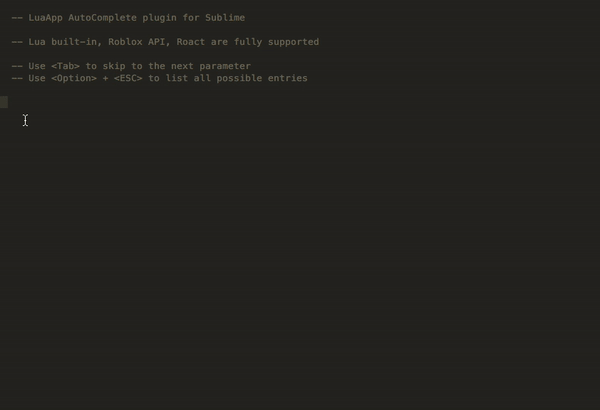
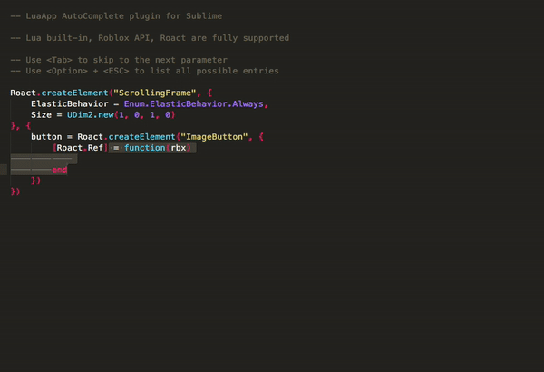

# RbxLuaApp_Sublime_Autocomplete
Roblox LuaApp AutoComplete plugin for Sublime

Lua built-in, Roblox API, Roact are fully supported

Installation:
* Open Sublime Text 3.
* Open packages folder using Preferences > Browse Packages in the menu.
* Copy the "RbxLuaApp" folder into the Packages directory. Please keep the folder name as "RbxLuaApp".
* Restart Sublime Text 3.

Usage:
* Use \<Tab\> to skip to the next editable parameter in the generated template
* Use \<Option\> + \<ESC\> to list all possible auto-complete entries

Demo:

